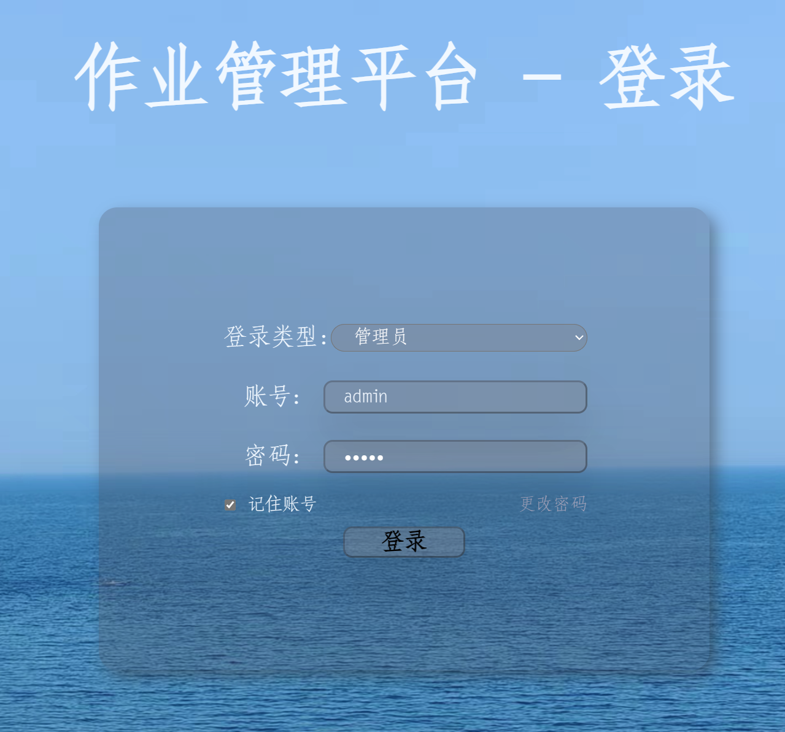

电子作业管理系统
===

## 项目介绍

>电子作业管理系统是一个基于Web的电子作业管理系统，主要功能有：

>- 学生端：
>    - 登录
>    - 上传作业
>    - 查看作业提交情况

>- 管理员端：
>    - 登录
>    - 管理学生信息
>    - 管理作业信息
>    - 管理文件信息
>    - 管理作业截止时间
>    - 下载学生作业文件

>本项目采用PHP作为后端语言，前端采用HTML、CSS、JavaScript，数据库采用MySQL，在保障性能的前提下，尽量分离前后端，实现API的封装与调用，拥有较高的灵活性
>可快速进行迭代与重构。

>为实现良好的协同合作开发，本项目开发采用git进行管理，git仓库地址：[GITHUB](https://github.com/Apricityx/AutoEmail)
## 项目开发进度
- [x] 完成邮件收发
- [x] 完成邮件服务器搭建
- [x] 实现数据库
    - [x] 实现数据库初始化脚本
        - 数据库需要存储的信息
        - #### 表1
            - 学生名字
            - 学生学号
            - 学生密码
        - #### 若干个表（每个表对应一个作业，表名则为作业名）
            - 学生名字
            - 学生学号
            - 学生是否提交
- [x] 实现登录页面
    - [x] CSS样式编写
    - [x] 实现数据库查询登录信息
    - [x] 实现更改密码
    - [ ] 实现忘记密码找回功能
- [x] 实现管理员页面
    - [x] 实现增加学科
    - [x] 实现数据库查询
    - [x] 实现文件下载
    - [x] ~通过已有数据库生成作业表~ 通过外键约束连接各个表
    - [x] 设置截止时间
    - 客户端访问API获取的信息示例见protocol.json
    - [x] 实现文件下载
    - [x] CSS样式编写
    - [x] 实现作业信息表
    - [x] 实现打包下载作业文件
- [x] 实现学生页面
    - [x] 实现数据库查询API
    - [x] 实现选择文件提交
    - [x] CSS样式编写
    - [x] 实现文件上传
    - [x] 对外实现提交作业API
- [ ] 实现DOCKER封装 
- [ ] 实现配置文件
### 项目环境

>- 语言：Python 3.6+
>- 数据库：MySQL 5.7+
>- PHP版本：8.1+


部署方式
---
## Linux

### 安装依赖：Python3.6+、MySQL5.7+、PHP8.1+
#### PYTHON部分：

>安装依赖
    ```shell
    pip install -r requirements.txt
    ```
#### MySQL部分：
>安装MYSQL
    ```shell
    sudo apt-get install mysql-server
    ```

>安装MYSQL驱动
    ```shell
    pip install mysql-connector-python
    ```
#### PHP部分：
>安装PHP
    ```shell
    sudo apt-get install php
    ```

> 安装PHP数据库操作扩展
    ```shell
    sudo apt-get install php-mysql
    ```
 
> 安装PHP解压缩扩展
    ```shell
    sudo apt-get install php-zip
    ```
### 环境配置
> 启用PHP扩展
    ```shell
    sudo phpenmod mysqli
    sudo phpenmod zip
    ```

> 启动MYSQL服务
>    ```shell
>    sudo service mysql start
>    ```
><br>请在项目目录下的database_passwd文件中修改数据库密码

> ### 拓展配置：启动PYTHON邮件服务器后端 
> <br>说明：此后端非必须，此后端作为学生发送作业的保障系统，使学生可以通过邮件发送作业
    ```shell
    python3 ./AutoEmail/Email/app.py
    ```
> <br>若需要启用此功能，请配置app.py的如下字段
> 
>    ```python
>        # 此处为示例地址，可以填写为自己的邮件服务器地址
>        # 邮件服务器地址
>        server_address = 'mail.apricityx.top'
>        # 邮件服务器端口
>        server_port = 587
>        # 发件人邮箱
>        user = 'mail@apricityx.top'
>        # 发件人邮箱密码
>        user_password = '520520MCt'
>        # 附件存储路径
>        path = '/var/www/html/homeworksubmit'
>    ```
### 安装支持PHP的WEB服务器，并将`AutoEmail`目录作为根目录 
### 管理系统初始化
>访问./WEB/Login/login.html，输入管理员账号密码，进入管理系统
>```shell
>    默认密码：
>    管理员：admin
>    密码：admin
>        
>    学生：222023321062100
>    密码：默认均为学号后六位
>```
>
>
> ### 按照目录下std_data.csv文件的格式编辑学生信息
> **警告：请严格按照示例文件std_data.csv来修改或添加学生信息，防止出现预料之外的问题**
> ### 上传完毕后点击初始化数据库并按提示操作
>
>
> ### 恭喜，您已经成功部署了电子作业管理系统


